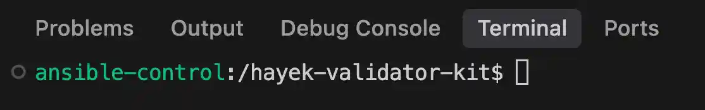

# Ansible Control

With your [Localnet running](solana-localnet.md#running-localnet), you'll have your default node be set as the `ansible-control` container. This node has [Ansible](https://docs.ansible.com/) installed and the goal is to run and automate all sysadmin ops through ansible scripts.

Having one of the nodes of the Localnet as the `ansible-control` allows all operators to control remote hosts from an identical environment, rather than having individually setup Ansible configurations on each workstation.

### Creating Validator Key Sets

Under the Ansible Control node you will find this script:

`/hayek-validator-kit/validator-keys/_gen-validator-keys.sh`

This script generates a new set of validator keys. These will be needed when provisioning a new validator on any of the containers in the Localnet cluster. A set of keys contains the following:

1. **Staked Identity Key**: It will always start with the characters `Z1`
2. **Vote Account Key**: It will always start with the characters `Z2`
3. **Stake Account Key**: It will always start with the characters `Z3`
4. **Authorized Withdrawer Account Key**: It will always start with the characters `Z4`
5. **Jito Relayer Block Engine Key**: It will always start with the characters `Z5`
6. **Jito Relayer Comms Key**: RSA keys in the `jito-relayer-comms-private.pem` and `jito-relayer-comms-public.pem` files.


There is never the need to run this script manually if you provision your validators using the Hayek Validator Kit Ansible playbooks provided, since they do this automatically for us. However, for development purposes it may be useful to understand this part a little further, ergo we take the time to explain more.


To generate a new set of keys, you should give them a name (aka: the validator name) and run the following commands from your Ansible Control:

```bash
# Set the keys directory and name your validator
KEYS_DIRECTORY="/hayek-validator-kit/validator-keys"
VALIDATOR_NAME="Sprout"

# Make a new directory for your key set
mkdir -p "$KEYS_DIRECTORY/$VALIDATOR_NAME"

# Move to the new key set directory
cd "$KEYS_DIRECTORY/$VALIDATOR_NAME"

# Run the script on the directory
$KEYS_DIRECTORY/_gen-validator-keys.sh
```

You can view the public keys of any of these respective private keys like this:

```bash
solana-keygen pubkey staked-identity.json
```

For convenience, we have also generated the public keys as a separate empty file for each of the keys. Each file-pair should look like this:

```
staked-identity-Z1RtExJVeFskxLD1D6RCPHH9NBpLHvcqKW8iXZfkMEK
staked-identity.json
```

You can view the full accounts by pasting their respective public keys in the [Localnet Explorers](solana-localnet.md#using-explorers).

### Packages and Software

The Ansible Control container is provisioned with the following

1. Solana CLI
2. Ansible
3. Python3
4. These packages: rsyslog, sudo, iproute2, openssh-client, git, curl, nano, openssl, tar, jq, less, tree

## Naming Validators

As you name new validators in Localnet or create new validator key sets, it will help you to think about their name relative to their total stake they will have. Our approach is to name the validators as follows:

* **Canopy**, Whale, Benjamin = large stake
* **Sprout**, Dolphin, Dollar = medium stake
* **Seed**, Shrimp, Penny = small stake

## Connecting to Ansible Control

To run playbooks and connect to the different validator nodes inside your Localnet, you must first connect to the Ansible Control node. Think of it as your Command Center for everything Solana from this point on.

### From Workstation VS Code (Recommended)

To connect to your Localnet Ansible Control node, you **HAVE** do it through VSCode or Cursor. When you open the local repo, it will automatically run the cluster, and connect to your Ansible Control node.

Your VSCode terminal should look like this:

<figure><figcaption></figcaption></figure>

### From Workstation Terminal

The Ansible Control node is a special docker container and you cannot directly ssh into it from your workstation terminal. You can connect to it like this:

```bash
# List the running containers from your docker engine
docker ps

# Connect to the container named 'ansible-control' and load 'bash'
docker exec -w /hayek-validator-kit -it ansible-control bash
```

## Connecting to Localnet Nodes

You can connect from your Ansible Control to any of your [Localnet Containers](solana-localnet.md#host-inventory) using SSH as follows:

```bash
# ssh <host-user>@<localnet-container>
ssh sol@host-alpha
```

## Ignoring Ansible Control


This option is not the recommended one. If you are stubborn and want to go this route, the rest of these docs may not make sense.


If you REALLY REALLY want to run the Ansible scripts from your workstation directly, instead of the Ansible Control node in Localnet, you'll need to install Ansible like this:

```sh
# install Ansible
# See https://ansible.readthedocs.io/projects/lint/installing/
pip3 install ansible
ansible --version

# install ansible-lint
pip3 install ansible-lint
ansible-lint --version
```

Another issue when running your containers NOT within the [Ansible Control within VS Code](ansible-control.md#from-workstation-vs-code-recommended), is that you will have to take care of managing the resources used by your Docker environment. When using Ansible Control within VS Code, the IDE automatically shuts down and reloads the containers when you open and close the repo folder.

```bash
docker compose down
```

## Email Sender

Sending emails using the [community.general.mail](https://docs.ansible.com/ansible/latest/collections/community/general/mail_module.html) module requires the configuration of an SMTP server to send the messages. We have a shared role, named `email_sender` to configure these variables.

The `email_vars.yml` file is encrypted with [Ansible Vault](../security-infrastructure/ansible-vault.md) since it contains sensitive information to the SMTP server. Open the file from the vault, and replace with your actual SMTP configuration:

```yaml
# SMTP Server Configuration
smtp_host: smtp.example.com
smtp_port: 587
smtp_username: "admin@example.com"
smtp_password: "example-app-password"
smtp_from: "admin@example.com"
smtp_from_name: "System Administrator"
```

## Common CLI Commands

```sh
# Check Solana version
solana --version

# List validators in Localnet
solana -ul validators --keep-unstaked-delinquents

# Verify your validators' ip addresses via Solana gossip 
solana -ul gossip | grep demoneTKvfN3Bx2jhZoAHhNbJAzt2rom61xyqMe5Fcw
```
