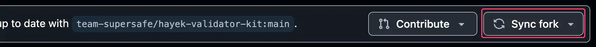

# GitHub Repo

All the configurations related to the Hayek Validator Kit as well as all documentation are [in this GitHub repo](https://github.com/team-supersafe/hayek-validator-kit.git), which you will have to clone locally and get familiar with its content and structure:

```bash
git clone https://github.com/team-supersafe/hayek-validator-kit.git
```

## Two Branches

The repo has two parallel branches named `main` and `docs` .

1. The `main` branch contains all the code and automation, and NONE of the docs.&#x20;
2. The `docs` branch contains all of the docs, and NONE of the code and automations.

The two branches are meant to co-exists in parallel Ad Infinitum without merging PRs from one to the other.&#x20;


Any GitHub suggestion to merge PR from `docs`  to `main`  to the other should be ignored.


You should get familiar with the contents of the repo.&#x20;

## Branch Workflows

Everything related to the Hayek Validator Kit lives under a public GitHub repo at `https://github.com/team-supersafe/hayek-validator-kit.git` . This workflow shows the ways you can engage with that repo to use it and contribute to it:

<figure><figcaption><p>Contributing Workflows</p></figcaption></figure>

## The "main" branch

The main branch is intended to be self explanatory. It should resemble this structure, but with your final actual validator roles and host names:

```
THE HAYEK SOLANA VALIDATOR KIT (@main)
│
├── ansible/
│   └── ansible.cfg        #the base config file for ansible
│   └── hosts.yml          #the list of hosts and their defined groupings
│   └── group_vars/        #store group specific variables
│   │  └── all.yml
│   │  └── group_a.yml
│   │  └── group_b.yml
│   └── host_vars/         #store host specific variables
│   │  └── host_a.yml
│   │  └── host_b.yml
│   │  └── host_c.yml
│   └── playbooks/         #store playbooks that run orchestrated workloads on hosts
│   │  └── pb_install_rust.yml     
│   │  └── pb_install_solana_cli.yml 
│   │  └── pb_setup_validator_jito.yml   
│   │  └── pb_change_validator_hw.yml      
│   └── roles/             #store host roles and their associated tasks and vars
│   │  └── carpenter/
│   │  └── plumber/
│   │  └── painter/
│   │  └── web_server/
│   │  └── db_server/
│   │  └── validator/
│   └──  vault/            #store sensitive variables that require encryption
│
├── solana-localnet/       #where all the solana-localnet is configued
│   └── build-cli/         #builds and run the solana cli in localnet 
```

The Localnet cluster is defined in the `Dockerfile` under the `solana-localnet` folder.

### Contributing to the Kit

This will show you how to do the upper/orange part of the [diagram above](github-repo.md#using-and-contributing) using the `main` branch.

If you want to contribute to improving the Ansible scripts and automation workflows of the Hayek Validator Kit, this is how you do it:

```bash
# fork the docs branch from the hayek-validator-kit repository
gh repo clone team-supersafe/hayek-validator-kit

# create a branch from your local main branch and switch to it
git checkout -b my-branch main
```

Once you are happy with your changes, make sure to [sync your **main** branch](https://docs.github.com/en/pull-requests/collaborating-with-pull-requests/working-with-forks/syncing-a-fork) before pushing. You can do this directly on the GitHub page for your forked repository:

<figure><figcaption></figcaption></figure>

After re-synch, make sure you merge any new updates into your `my-branch` branch and push your changes to GitHub to start the [Pull Request](https://docs.github.com/en/pull-requests/collaborating-with-pull-requests/proposing-changes-to-your-work-with-pull-requests/about-pull-requests) process.

### Using the Hayek Validator Kit

This will show you how to do the lower/purple part of the [diagram above](github-repo.md#using-and-contributing).

If you want to use the Hayek Validator Kit for your own validator operations, and keep your configuration private, you might find it a little challenging to use the GitHub Forking infrastructure for this purpose.

GitHub restricts forking from public to private repositories because the GitHub Forking Network is designed exclusively for public-to-public repository contributions. If you want to mimic a similar behavior but do it from `public` to `private` repo, then:

```bash
# 1. Add the remote (under a custom name so it doesn't conflict)
git remote add hayek https://github.com/team-supersafe/hayek-validator-kit

# 2. Fetch from that remote
git fetch hayek

# 3. Checkout your main branch
git checkout main

# 4. Merge the changes of hayek-validator-kit repo into yours (preserves local changes/conflicts)
git merge hayek/main
```

Make your changes needed while keeping up to date with the contributions made by collaborators on the Hayek Validator Kit.

## The "docs" branch

The docs branch is intended to be self explanatory. It contains a single folder aptly named `docs` with five doc spaces for the different categories we cover here:

```
THE HOME OF THE HAYEK VALIDATOR KIT DOCUMENTATION (@docs)
│
├── docs/
│    └── product-docs/    # The docs for the different Hayek products
│    └── public-goods/    # The docs specifically for the Hayek Validator Kit
│    └── guides/          # Miscellaneous step by step guides
│    └── changelog/       # A list of the change logs across Hayek
│    └── help/            # The help and support center 

```

### Contributing to the Docs

This will show you how to do the upper/orange part of the [diagram above](github-repo.md#using-and-contributing) using the `docs` branch.

The docs are hosted by [GitHub](https://github.com/), managed by [GitBook](https://gitbook.com), and deployed to [https://docs.hayek.fi](https://docs.hayek.fi/)

If you want to contribute to improving the docs, this is how you do it:

```bash
# fork the docs branch from the hayek-validator-kit repository
gh repo clone team-supersafe/hayek-validator-kit

# create a branch from your local docs branch and switch to it
git checkout -b doc-improvements docs
```

Once you are happy with your changes, make sure to [sync your **docs** branch](https://docs.github.com/en/pull-requests/collaborating-with-pull-requests/working-with-forks/syncing-a-fork) before pushing. You can do this directly on the GitHub page for your forked repository:

<figure><figcaption></figcaption></figure>

After re-synch, make sure you merge any new updates into your `doc-improvements` branch and push your changes to GitHub to start the [Pull Request](https://docs.github.com/en/pull-requests/collaborating-with-pull-requests/proposing-changes-to-your-work-with-pull-requests/about-pull-requests) process.
