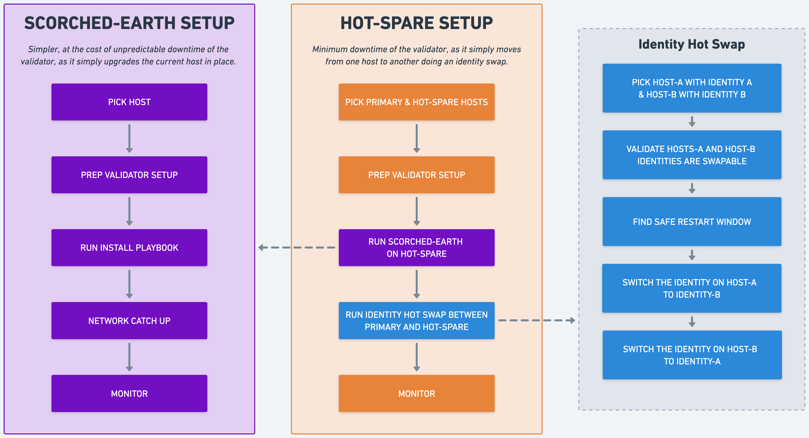

# Revenue & Performance

## Skipped Leader Slots

## APY

## Income

Income for a validator is measured by epoch. Primary sources of income and expenses vary according to the table below:

<table><thead><tr><th width="356.01171875">Name / Description</th><th width="180.3203125">Who pays it</th><th>When and how is paid</th></tr></thead><tbody><tr><td><mark style="background-color:green;"><strong>Commission</strong></mark>: The percentage of <em><strong>inflation</strong></em> rewards collected by the validator from inflation (SOL created on every epoch) as commission for voting and securing the network.</td><td>Inflationary Rewards as part of a scheduled inflation rate that mints new SOL.</td><td>Per epoch. Rewards for epoch N are paid in the first block of epoch N + 1. Rewards depend on the inflation rate, the validator’s stake-weight (amount of SOL staked to the validator vs. total network stake), the TVC accrued in epoch N and the configured commission.<br><mark style="background-color:green;">Paid to</mark> the validator's vote account.</td></tr><tr><td><mark style="background-color:green;"><strong>Transaction Fees</strong></mark><strong> (part of Leader Slot Rewards)</strong>: 50% of all standard transaction fees in the block produced.</td><td>Users who submit transactions to the Solana network</td><td>Per block produced.<br><mark style="background-color:green;">Paid to</mark> the validator's identity account.</td></tr><tr><td><mark style="background-color:green;"><strong>Priority Fees</strong></mark><strong> (part of Leader Slot Rewards)</strong>: 100% of all priority (CU-based) fees in the transactions that were included in the block produced.</td><td>Users who submit transactions to the Solana network</td><td>Per block produced.<br><mark style="background-color:green;">Paid to</mark> the validator's account of identity.</td></tr><tr><td><mark style="background-color:red;"><strong>Voting Fees</strong></mark>: Also known as vote transaction fees, these are a small cost that validators pay to submit votes to the network as any other Solana transaction.</td><td>Every validator pays this to earn <a href="./#timely-vote-credits-tvc">TVC</a>.</td><td>Per block.<br><mark style="background-color:red;">Paid from</mark> the validator's identity account.</td></tr><tr><td><mark style="background-color:green;"><strong>Voting Compensation</strong></mark>: Offered by the SFDP, this initiative enables smaller or newer validators to remain financially sustainable by offsetting the cost of voting fees.</td><td>Solana Foundation through the SFDP</td><td>Per epoch.<br><mark style="background-color:green;">Paid to</mark> the validator's identity account.</td></tr><tr><td><mark style="background-color:green;"><strong>Jito Rewards</strong></mark>: Only applicable if you are running the Jito-Solana client, which enables MEV tip capture via the Jito Block Engine</td><td>Bots, searchers who want to front-run, back-run, or bundle transactions for arbitrage</td><td>Per block.<br><mark style="background-color:green;">Paid to</mark> the validator's identity account.</td></tr></tbody></table>

## Leader Slot Rewards example

Let´s take for example slot `349075076`  on `mainnet-beta`. The Hayek validator (with identity `hykfH9jUQqe2yqv3VqVAK5AmMYqrmMWmdwDcbfsm6My`) was assigned as leader in the leader schedule and it produced a block for which it was rewarded with `0.015671734 SOL` which increased its SOL balance to `44.112034624 SOL`, you can see this in the Solana explorer [here](https://explorer.solana.com/block/349075076/rewards):

<figure><figcaption></figcaption></figure>

The following are the transactions from blocks `349075076` and `349075077` where the identity account `hykfH9jUQqe2yqv3VqVAK5AmMYqrmMWmdwDcbfsm6My` participated. Leader slot rewards are also included:

| Block     | Index In Block | Transaction ID                                                                                                                                                                                                        | Pre-Balance | Post-Balance | Balance Change | Block Reward |               Description              |
| --------- | :------------: | --------------------------------------------------------------------------------------------------------------------------------------------------------------------------------------------------------------------- | ----------- | ------------ | :------------: | ------------ | :------------------------------------: |
| 349075076 |       273      | [`4CbJFJdWeJxg5Ng1ZhKaz6iiEo6b4nK2u4mSXMQ9BSCr9cCdoWG2DSthbAnFt44c6pSjwrav4RSN7MsqhzkujJas`](https://explorer.solana.com/tx/4CbJFJdWeJxg5Ng1ZhKaz6iiEo6b4nK2u4mSXMQ9BSCr9cCdoWG2DSthbAnFt44c6pSjwrav4RSN7MsqhzkujJas) | 44098438050 | 44098433050  |      -5000     | -            |        Validator vote: TowerSync       |
| 349075076 |      1443      | [`5RgPSgiAcrztN9SkivtWeFWzDeerZb3UNQ2MaFvZqGZ2kfAAeS56GdJx3gLnLQdwwTYd9fm3v9XabnkCkCNcXrgE`](https://explorer.solana.com/tx/5RgPSgiAcrztN9SkivtWeFWzDeerZb3UNQ2MaFvZqGZ2kfAAeS56GdJx3gLnLQdwwTYd9fm3v9XabnkCkCNcXrgE) | 44098433050 | 44096367890  |    -2065160    | -            | Jito: InitializeTipDistributionAccount |
| 349075076 |      1444      | [`4XDqZneXwuC68HU3TKapwDa4BQV6mxunxAX7DFUnNSp43d8ecY7y24tigbQ7R9nXexF7WEvPDi3JPM3Fi5kpnUgL`](https://explorer.solana.com/tx/4XDqZneXwuC68HU3TKapwDa4BQV6mxunxAX7DFUnNSp43d8ecY7y24tigbQ7R9nXexF7WEvPDi3JPM3Fi5kpnUgL) | 44096367890 | 44096362890  |      -5000     | -            |         Jito: ChangeTipReceiver        |
| 349075076 |        -       | -                                                                                                                                                                                                                     | 44096362890 | 44112034624  |    15671734    | 15671734     |           Leaser Slot Rewards          |
| 349075077 |       18       | [`659MYAXgWBeJUYS3Mi722QiN3prRX8rTCRcnBARap2PCsQiMRcR8DrNTTo5MoYGqyqmwgfgWeTh19gewehRCTNkU`](https://explorer.solana.com/tx/659MYAXgWBeJUYS3Mi722QiN3prRX8rTCRcnBARap2PCsQiMRcR8DrNTTo5MoYGqyqmwgfgWeTh19gewehRCTNkU) | 44112034624 | 44112029624  |      -5000     | -            |        Validator vote: TowerSync       |
| 349075077 |        -       | -                                                                                                                                                                                                                     | 44112029624 | 44124345405  |    12315781    | 12315781     |           Leaser Slot Rewards          |

As you can see, leaser slot rewards or block rewards are credited to the validator identity account at block level and not as part of a transaction.

You can use this command to get the block data including transactions and block rewards:\


```
curl --location 'https://api.mainnet-beta.solana.com' \
--header 'Content-Type: application/json' \
--data '{
    "jsonrpc": "2.0",
    "id": 1,
    "method": "getBlock",
    "params": [
        349075076,
        {
            "encoding": "json",
            "maxSupportedTransactionVersion": 0,
            "transactionDetails": "full",
            "rewards": true
        }
    ]
}'
```

## Timely Vote Credits (TVC)

## Commission
